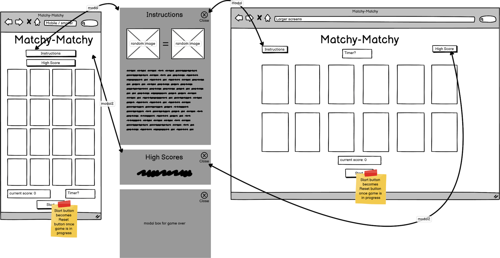
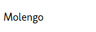
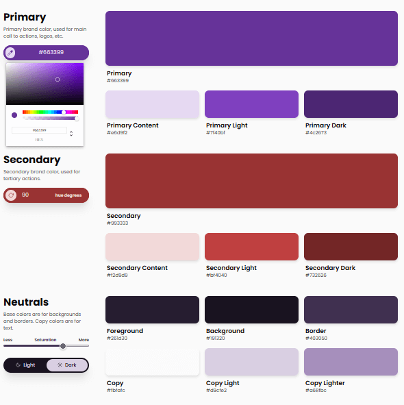

# simon-project-2
# Matchy-Matchy
A website written using HTML, CSS and Javascript. This website will run a pair matching game which I have called Matchy-Matchy. 

Link to project board (Kanban): https://github.com/users/motogoatUK/projects/5
## User Experience (UX)

### Strategy
To create a memory game for casual gamers and other users to play and help improve memory skills. 
#### User goals:
The full user stories along with acceptance criteria and associated tasks can be found in the project board linked [here](https://github.com/users/motogoatUK/projects/5) and above. Below is a short summary of these goals:
 - Visitor requires responsive layout
 - Player wants a clean game interface
 - Gamer wants to play the game
 - Player wants to see high score
 - Player would like to see varying images
 - Gamer wants to personalise the game experience
 - Gamer would like to see animations and/or sound

### Scope
**Must-have** *Required features for production release:*
- Responsive layout
- Game interface
- Game actions
- High Score  

**Should-have** *Features for next release:*
- Varying images
- Personalised Experience  

**Could-have** *Features for future releases:*  
- Animations & Sound  

### Structure
All features on a single HTML page using modal windows for additional information (e.g. scores/instuctions)  
404 error page to direct back to main page.  
As this is just a single page website I decided not to use bootstrap and instead use flex and CSS media queries for layout.  

### Skeleton
Wireframe mockup generated in Balsamiq.  [Open wireframe pdf](assets/matchy-matchy.pdf)
### Surface
#### Fonts &amp; Colours
Fonts were selected with help from [fontjoy.com](https://fontjoy.com) as follows:  
Usage | Font | Sample 
---|---|---
Main body / headings:| Rubik |  
Copy text:| Molengo |  
Impact / button text:| Chango |  

The colour palette was generated at hover.dev based on an initial colour of rebeccapurple.

## Development
- IDE: Visual Studio Code
- local http server: Python
- Browser and Developer tools: Firefox
- Version control: Github
- Project board: Github Kanban
- Accessibility: WebAIM.org

1. Add basic HTML layout and styles
1. Add in colours from palette
1. Style modal boxes. Search on stackoverflow.com for ideas on showing multiple modals.
1. Style game area. Add in responsive breakpoints.
1. Add event listeners for Instrustions and High score button and test.
1. Final styling for gameboard interrface and test responsiveness across different device widths.
1. Create code for gameboard. Assign cards values
1. add event listeners for card selections
1. add code to display the cards values
1. add code to flip cards once displayed
1. add code to check for a match
1. add code to prevent selecing more than 2 cards including selecting the same card twice
1. add notification area (overlay)
1. remove testing code and add startgame function.
1. Add code to reset the game
1. add score and highscore functions
1. code to check for misses
1. code to check for endgame.

## Testing

### Manual Testing
*Manual testing is used to evaluate the project and to find bugs and areas for improvement.*  
Testing during development using Firefox Dev Tools in responsive design mode.
The code was tested at each stage using Firefox with Dev tools including debugger.

### Automated Testing
*Automated tests are written in order to maintain the functionality and detect breaking changes in the code.*  

### Bugs
##### 2025-05-15
> Using `.modal` and `.modal-content` classes for multiple modals would cause them to show at same time when adding `display:block` to the `.modal` class. However assigning `display:block` to the individual id's instead caused the modal overlay to remain in place when the modal content was subsequently hidden.
>##### FIX:
>With a bit of research on stackoverflow.com (and use of console.log messages), I gathered enough information to enable me to work out I needed to add event listeners to each close button and target the parents parent node to hide the modal. This is what I came up with:  
`[...btnClose].forEach(element => {
    element.addEventListener("click", (e) => { e.target.parentNode.parentNode.style.display = 'none'; });  
});`  
##### 2025-05-16
> Game interface responds well to all different display widths, but only in portrait mode. when switching to landscape the game board can only display the first row / row and half  
>##### FIX:
> not fixed  
##### 2025-05-18
> Clicking same card twice produces a match. Changed .onclick to addEventListeners but could not get removeEventListeners to work.
>##### FIX
> Searching on stackoverflow.com I learned about the `{once: true}` property of addEventListener. I implemented it and it worked fantastically to prevent double clicking on the same card.
##### 2025-05-20
> Clicking a third selection sometimes flips the card into play even though the code was written to ignore further selections.
>##### FIX: 
>This turned out to be due to timing of the check match function removing cards from the flippedArray before another delay to flip the cards back over. The reason the removeEventListeners didn't work was due to the eventListeners being set up with an anonymous function (as we were passing in the index as a variable). One possible solution mentioned by Robert Thompson from Dudley College was that I might set up a game variable that I could monitor when the matches were being checked. This was the route I took and set up a boolean `inProgress` that I could check before flipping a card and set to false within the match function and then set back to true in the delayed hideFlipped function calls. 

## Deployment

## Credits
https://www.hover.dev/css-color-palette-generator for the colour palette ideas
https://www.w3schools.com/ for help with localStorage (to save scores)  
Rory Patrick Sheridan for his excellent mentoring sessions.