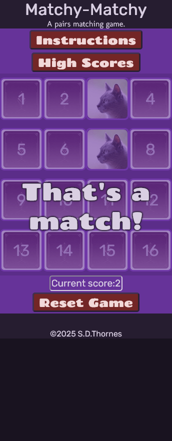
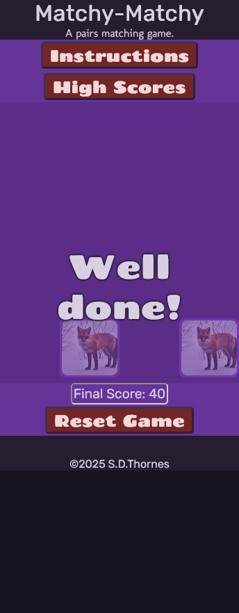
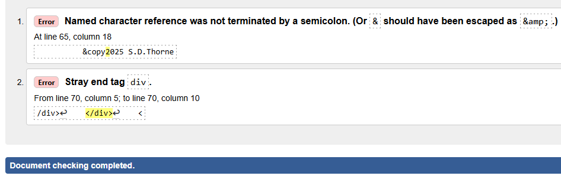
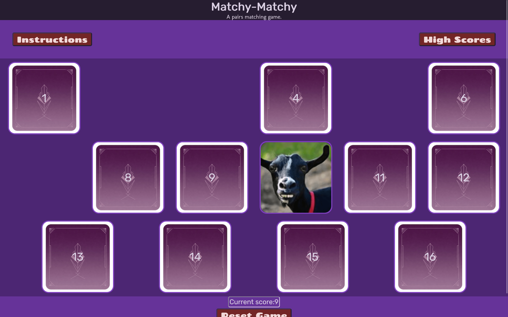

# simon-project-2
# Matchy-Matchy
A website written using HTML, CSS and Javascript. This website will run a pair matching game which I have called Matchy-Matchy. 

Link to project board (Kanban): https://github.com/users/motogoatUK/projects/5
## User Experience (UX)

### Strategy
To create a memory game for casual gamers and other users to play and help improve memory skills. 
#### User goals:
The full user stories along with acceptance criteria and associated tasks can be found in this [project board](https://github.com/users/motogoatUK/projects/5) linked here and above. Below is a short summary of these goals:
 - Visitor requires responsive layout
 - Player wants a clean game interface
 - Gamer wants to play the game
 - Player wants to see high score
 - Player would like to see varying images
 - Gamer wants to personalise the game experience
 - Gamer would like to see animations and/or sound

### Scope
**Must-have** *Required features for production release:*
- Responsive layout
- Game interface
- Game actions
- High Score  

**Should-have** *Features for next release:*
- Varying images
- Personalised Experience  

**Could-have** *Features for future releases:*  
- Animations & Sound  

### Structure
All features on a single HTML page using modal windows for additional information (e.g. scores/instuctions)  
404 error page to direct back to main page.  
As this is just a single page website I decided not to use bootstrap and instead use flex and CSS media queries for layout.  

### Skeleton
Wireframe mockup generated in Balsamiq.  [Open wireframe pdf](assets/readme-files/matchy-matchy.pdf)
### Surface
#### Fonts &amp; Colours
Fonts were selected with help from [fontjoy.com](https://fontjoy.com) as follows:  
Usage | Font | Sample 
---|---|---
Main body / headings:| Rubik |  
Copy text:| Molengo |  
Impact / button text:| Chango |  

The colour palette was generated at hover.dev based on an initial colour of rebeccapurple.

## Development
- IDE: Visual Studio Code
- local http server: Python
- Browser and Developer tools: Firefox
- Version control: Github
- Project board: Github Kanban
- Accessibility: WebAIM.org

1. add basic HTML layout and styles
1. add in colours from palette
1. style modal boxes. Search on stackoverflow.com for ideas on showing multiple modals.
1. style game area. Add in responsive breakpoints.
1. add event listeners for Instructions and High score button and test.
1. final styling for gameboard interrface and test responsiveness across different device widths.
1. create code for gameboard. Assign cards values
1. add event listeners for card selections
1. add code to display the cards values
1. add code to flip cards once displayed
1. add code to check for a match
1. add code to prevent selecing more than 2 cards including selecting the same card twice
1. add notification area (overlay)
1. remove testing code and add startgame function.
1. add code to reset the game
1. add score and highscore functions
1. code to check for endgame
1. code to check for misses
1. add shuffle function
1. replace letters with images on card faces

## Testing

This project uses manual testing procedures only but automated testing is discussed below.  

### Manual Testing
*Manual testing is used to evaluate the project and to find bugs and areas for improvement.*  
This includes human interaction and visual checks. It test the application from a users perspective. 
Testing during this application's development was done using Firefox Dev Tools in responsive design mode.
The code was tested at each stage using Firefox with Dev tools including debugger.  

### Automated Testing
*Automated tests are written in order to maintain the functionality and detect breaking changes in the code.*  
Tests are written to expect a certain result based on inputs. These are mainly for coding routines but can also be used to check for changes in the DOM. they can't be used for visual styling.

#### Summary
Development requires a mix of both manual and automated testing routines for the best outcome. Manual testing is more time-consuming so thought must be given to use automated testing where possible.

#### Project Testing Procedures 
Once deployed, the project was tested using various devices including a laptop and mobile phone. On the desktop, the browsers Edge, Chrome and Firefox were used to certify compatibility. The following tests were written for the application:  

| Test | outcome | Pass/Fail | image |
|---|---|---|---|
|Instructions should be displayed when the app is loaded.| Instructions displayed on page load | Pass |  
| clicking either the X of outside the instructions area should close the modal | modal closes in both circumstances | Pass
| It should be apparent that the Start button should be pressed.| Instructions mention this also there is an overlay showing where the start button is located and that it should be pressed | Pass|  
| selecting any card before start is pressed should have no effect | clicking on the cards have no effect | Pass
| clicking the "High Scores" button should open the Highscore modal | clicking the button opens the modal | Pass |  |
| when the user clicks Start the game should start accepting selections | Once start is clicked cards can be selected | Pass|  
| when the start button is pressed it should become a reset game button | Start button shows as reset game after being pressed | Pass | as above |
| when the reset game button is pressed the game should be reloaded | Pressing reset reloads the game to it's inital state | Pass
| when a card is selected it should flip over to show the face | When a card is selected it reveals an image | Pass|  
| once a second card is selected, trying to select a third card should display a message | Message displayed and card is not shown | Pass|  
| showing 2 matching faces should increase the score | score increases when a match is made | Pass | shown below |
| showing 2 matching faces should nofity the user of a match | "It's a Match!" is displayed | Pass|  
| after a match both cards should disappear from the board | Cards disappear once matched | Pass|  
| After a non-match both cards should flip back over and remain in play | Both cards turn back over and can be selected again | Pass
| If a card that has previously been shown is not matched, message should be displayed and 1 life removed.| Message showing Missed match is dsplayed and chances remaining is also displayed | Pass  |  
| If a missed match is shown 6 times the game should end immediately with a message shown | "Game Over" is displayed | Pass |  |
| After all cards are matched, a congratulatory message should be shown | "Well done" or "High Score" is displayed | Pass |  
| After all cards are matched, the final score should be shown | Final score shows at bottom of screen where the score was shown | Pass 
| If a highscore is attained a message should show this. The High score should be updated | "High Score" is shown and the High score modal reflects the new high score | Pass |  
| When the game is over, clicking any any remaing cards should have no effect | When the game is over it is not possible to select any remaining cards | Pass 

#### Code testing
- HTML validator.w3.org - 2 errors 
- CSS - jigsaw.w3.org - Passes CSS3, no errors.
-----
- Javascript - JSHint - using a front end written during the course - 36 errors mainly Unnecessary semicolons. Once these were removed 4 errors.   
Line 188 changed from:  
    `game.cardsMatched.length === game.cards.length ? endGame(true) : hideFlipped();`  
    to:  
    `if (game.cardsMatched.length === game.cards.length) { `  
     `   endGame(true);  `  
    `} else {  `  
     `   hideFlipped();`  
    `}  `
Line 275 changed from:
     `w ? notify("Well done!") : notify("Game Over!");`  
    to:  
    `const endMessage = w ? "Well done!" : "Game Over!";`  
    `notify(endMessage);`  

### Bugs
##### 2025-05-15
> Using `.modal` and `.modal-content` classes for multiple modals would cause them to show at same time when adding `display:block` to the `.modal` class. However assigning `display:block` to the individual id's instead caused the modal overlay to remain in place when the modal content was subsequently hidden.
>##### FIX:
>With a bit of research on stackoverflow.com (and use of console.log messages), I gathered enough information to enable me to work out I needed to add event listeners to each close button and target the parents parent node to hide the modal. This is what I came up with:  
`[...btnClose].forEach(element => {
    element.addEventListener("click", (e) => { e.target.parentNode.parentNode.style.display = 'none'; });  
});`  
##### 2025-05-16
> Game interface responds well to all different display widths, but only in portrait mode. when switching to landscape the game board can only display the first row / row and half  
>##### FIX:
> ~~not fixed~~ 2025-05-26 - Added media queries for different heights of viewport on smaller screens.  
##### 2025-05-18
> Clicking same card twice produces a match. Changed .onclick to addEventListeners but could not get removeEventListeners to work.
>##### FIX
> Searching on stackoverflow.com I learned about the `{once: true}` property of addEventListener. I implemented it and it worked fantastically to prevent double clicking on the same card.
##### 2025-05-20
> Clicking a third selection sometimes flips the card into play even though the code was written to ignore further selections.
>##### FIX: 
>This turned out to be due to timing of the check match function removing cards from the flippedArray before another delay to flip the cards back over. The reason the removeEventListeners didn't work was due to the eventListeners being set up with an anonymous function (as we were passing in the index as a variable). One possible solution mentioned by Robert Thompson from Dudley College was that I might set up a game variable that I could monitor when the matches were being checked. This was the route I took and set up a boolean `inProgress` that I could check before flipping a card and set to false within the match function and then set back to true in the delayed hideFlipped function calls. 
##### 2025-05-22
> Using localStorage to save the highscore isn't working (it doesn't store it)
>code: `if (gameStorage) { localStorage.setItem("highScore", game.score)};` `gameStorage` is showing as `true` at that point in debugger.
>##### FIX:
>I read this on MDN web docs: "`Storage` only supports storing and retrieving strings. If you want to save other data types, you have to convert them to strings." On checking game.score is a number so the code is now: `if (gameStorage) { localStorage.setItem("highScore", game.score.toString())};`
When that still didn't work, I looked at the code again and found I was setting it with **highScore** but when reading it I was using **highscore**! Set both to *highscore* and it works.
##### 2025-05-29
>Found while preparing responsive design screenshots. At certain screensizes the modal doesn't fully cover the full length of the screen, allowing the start button to be pressed, leaving the instructions on-screen.

>##### FIX:
>I discovered that moving the instructions up on smaller screens moved the entire modal. modified the code targeting `#modal-instructions` to `#modal-instructions > .modal-content` I couldn't just change it to `.modal-content` as this would have also affected the other modals.

## Deployment

The below steps are used to deploy the project to Github pages.  
1. Login to github and select the repository **motogoatUK/simon-project-2**
1. From the menu items near the top right select **Settings**
1. Select the **Pages** from the left hand side menu
1. Under *Branch* select **main** branch
1. Select **Save** to confirm  
Once confirmed, GitHub will build and deploy the site. After a few minutes a link should be shown under the **GitHub Pages** section as shown in the image below.  
You may need to refresh the page to see the link. For this project the link is [https://motogoatuk.github.io/simon-project-21](https://motogoatuk.github.io/simon-project-2)  

The project can be worked on locally by cloning the repository  
#### How to Clone a Repository

1. Navigate to the repository [https://github.com/motogoatuk/simon-project-2]
2. Click the Code button and copy the repository URL
3. Open your terminal (or Git Bash)
4. Change your working directory to where you want the cloned directory to be made
5. Type _git clone_ then paste in the [repository URL] from step 2
6. Press Enter

## Deployed project
  
#### User story compliance
| User story | proof |
| :--- | --- |
| - Visitor requires responsive layout | see responsive screenshots below
| - Player wants a clean game interface | 
| - Gamer wants to play the game | 
| - Player wants to see high score | 
| - Player would like to see varying images | next release
| - Gamer wants to personalise the game experience | next release
| - Gamer would like to see animations and/or sound | future release

#### Responsive screenshots
| Device | portrait / normal | landscape / widescreen  
| --- | --- | --- 
| Galaxy Z fold |  |  |
| Iphone |  |  | 
| Ipad |  | 
| Laptop |  |  
| Desktop |  |  | 
| Ultrawide | 

## Credits
https://www.hover.dev/css-color-palette-generator for the colour palette ideas  
https://www.w3schools.com/ for help with localStorage (to save scores) among many other things  
[stackoverflow.com](https://stackoverflow.com/questions) for seeing interesting different ways to accomplish the same goal.  
[wikipedia](https://en.wikipedia.org/wiki/Fisher-Yates_shuffle) for the Fisher-Yates shuffle code.  
Rory Patrick Sheridan (Code Institute) for his excellent mentoring sessions.  
Robert Thompson (Dudley College) for invaluable guidance